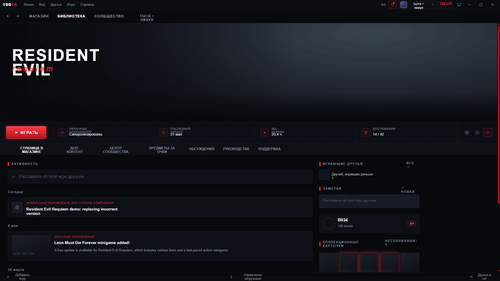
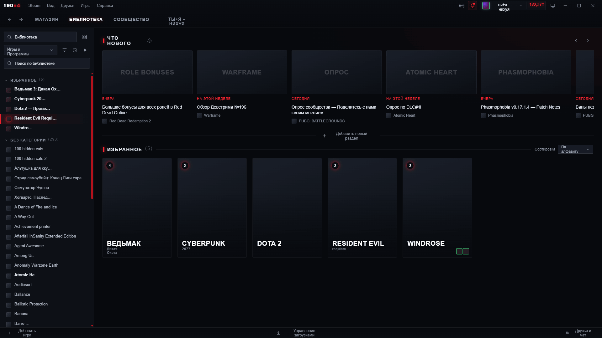
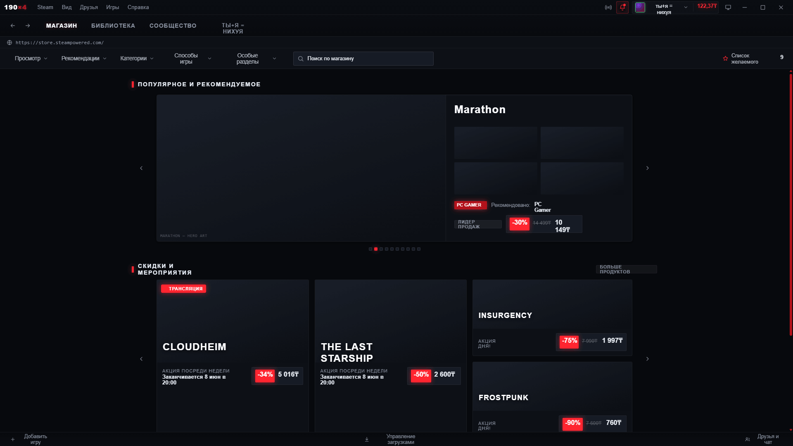
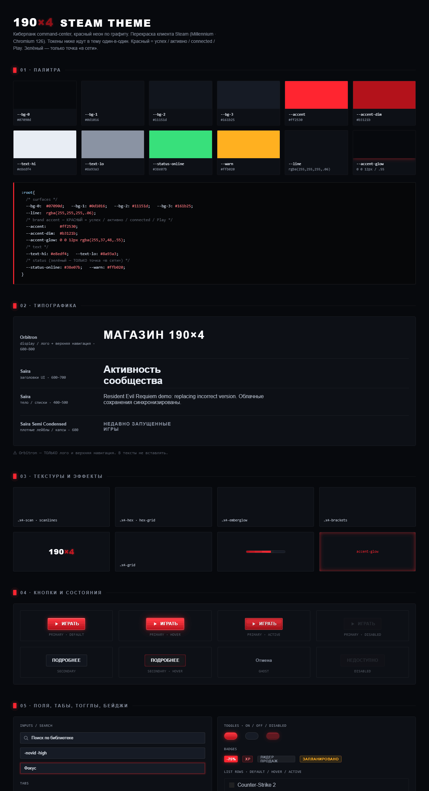

<div align="center">

# 190×4

**Киберпанк command-center тема для клиента Steam — красный неон по графиту.**

Тёмная тема для [Millennium](https://github.com/SteamClientHomebrew/Millennium).

`Windows` · `Linux` · клиент Steam

[English version →](README.md)

</div>

---

## Превью

| Страница игры | Библиотека |
|---|---|
|  |  |

| Магазин | Дизайн-система |
|---|---|
|  |  |

---

## Как устроено

Steam рисует клиент **хешированными** классами (`._3cI5TX…`), которые меняются на каждой
сборке — адресовать их напрямую и пережить апдейт нельзя. Но исходные классы
**семантически именованы**, и Steam держит этот реестр в своих webpack-модулях (CSS-модули —
объекты, где все экспорты строки).

Тема читает реестр в рантайме (`client/resolver.js`), резолвит **стабильное имя → текущий
хеш** и вешает на элементы наши стабильные метки (`data-x4="play-button"` …). CSS
(`client/client.css`) стилизует эти метки. Никаких чужих хеш-списков и гонки за сборками.

```
skin.json            манифест (RootColors, Steam-WebKit, Patches)
theme/colors.css     палитра (RootColors) — цвета править здесь
client/resolver.js   читает реестр классов Steam → вешает data-x4
client/client.css    фундамент + правила на data-x4 + логотип
webkit/store.css     магазин/сообщество (стабильные классы, напрямую)
tools/dump-classmap.js  сниппет в консоль: выгрузить весь реестр имя→хеш
design/              кастомные референс-макеты (ориентир)
```

**Правила бренда:** красный `#ff2530` = акцент / Play / выбранное / connected (синий Steam
перекрашен); зелёный `#38e07b` = только онлайн-статус; графит, острые углы.

---

## Установка

Millennium должен быть установлен ([инструкция](https://docs.steambrew.app/users/installing)).

1. Скачать zip релиза, распаковать папку `190x4/` в:
   ```
   <Steam>/millennium/themes/190x4/
   ```
   На Windows обычно `C:\Program Files (x86)\Steam\millennium\themes\190x4\`.
2. В Steam открыть **Millennium → Themes**, выбрать **190x4**, перезапустить Steam.
3. Цвета — в `theme/colors.css`.

---

## Картирование клиента (DevTools)

Резолвер бьёт по стабильным именам; чтобы зафиксировать их точно под твою сборку:

1. Millennium → **developer mode** → правый клик в окне Steam → **Inspect** → **Console**.
2. С установленной темой выполни `x4.dump()` (или вставь `tools/dump-classmap.js`). Он
   скопирует весь реестр `{ ИмяКласса: хеш }` в буфер.
3. Сохрани как `classmap.json` — по нему финализирую `TARGETS` в `client/resolver.js` под
   реальные имена твоей сборки.

`x4.findClass("PlayButton")` — резолв одного имени в консоли.
